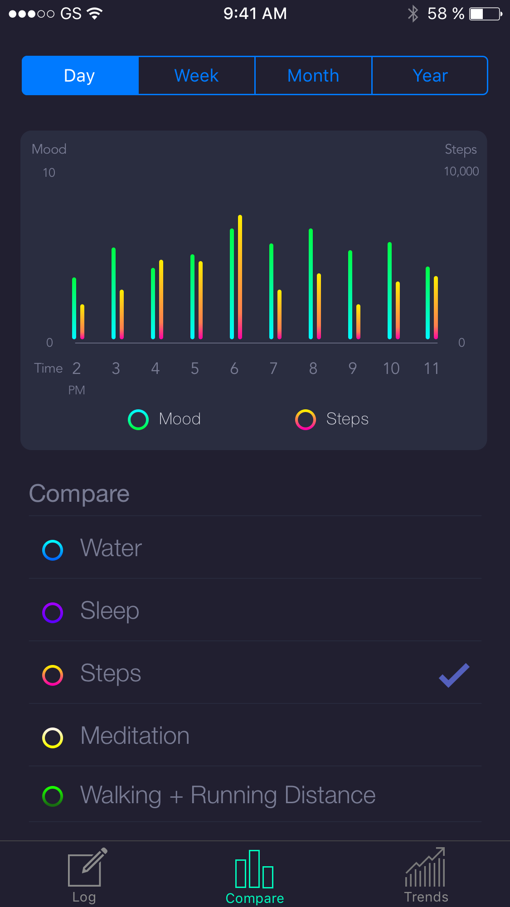
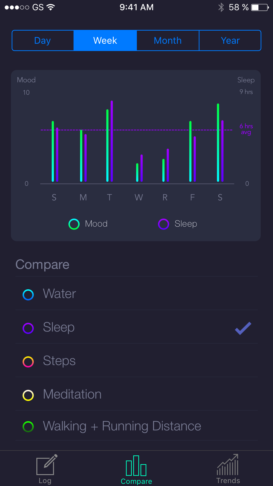
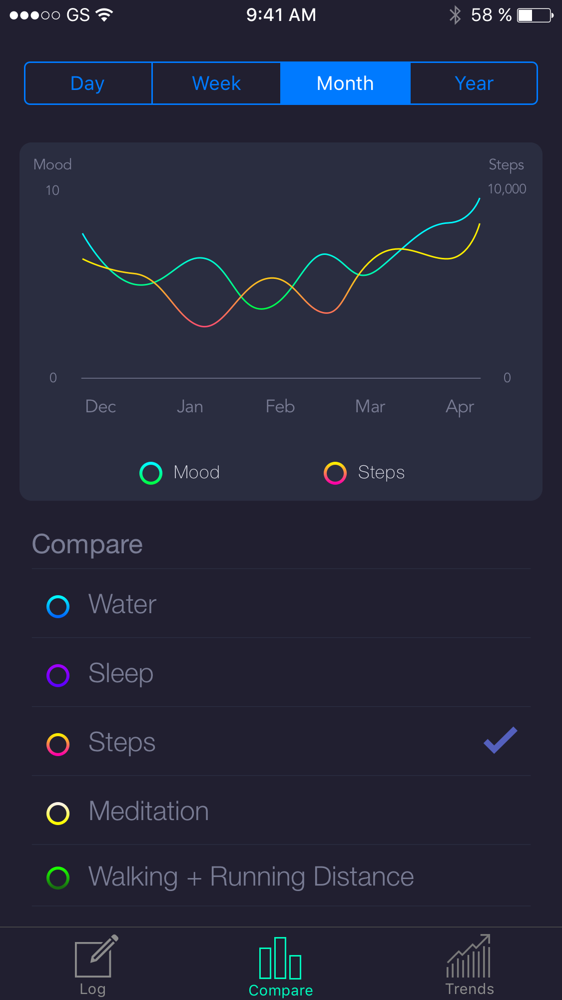
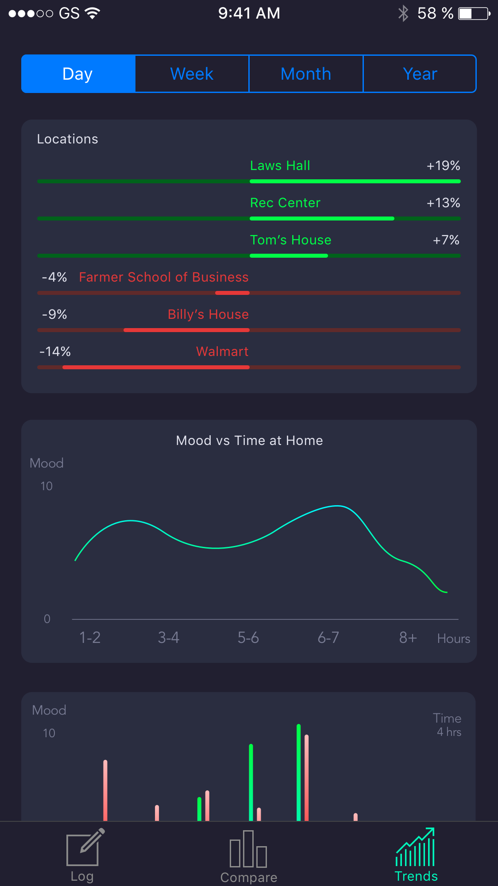
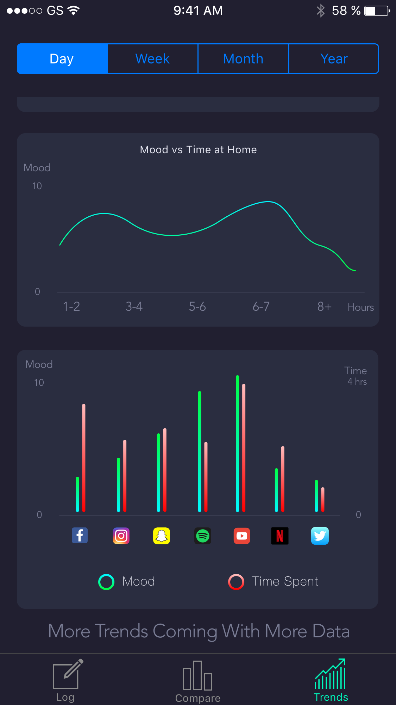

# Trackr

Trackr is a mobile application written in react-native that tracks a users mood over time and compares it with other health stats to promote better mental health. Takes advantage of HealthKit.

## Mocks

Log

Compare

Trends

## License

This project is licensed under the MIT License
