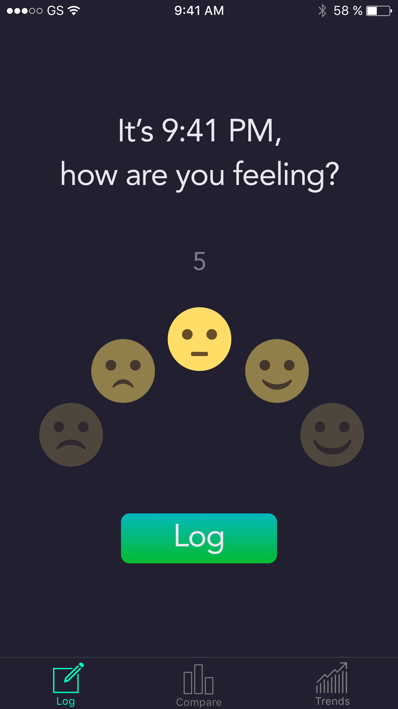
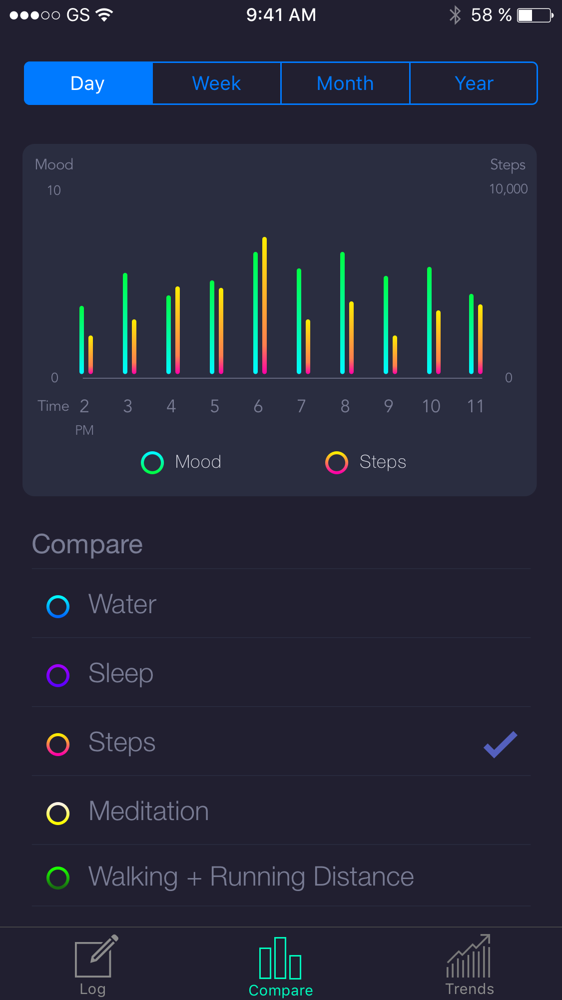
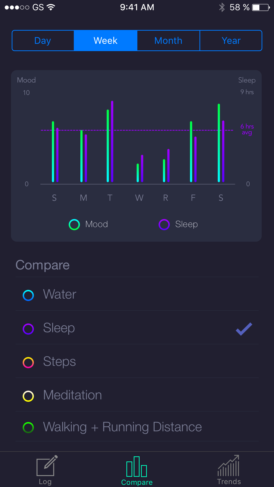
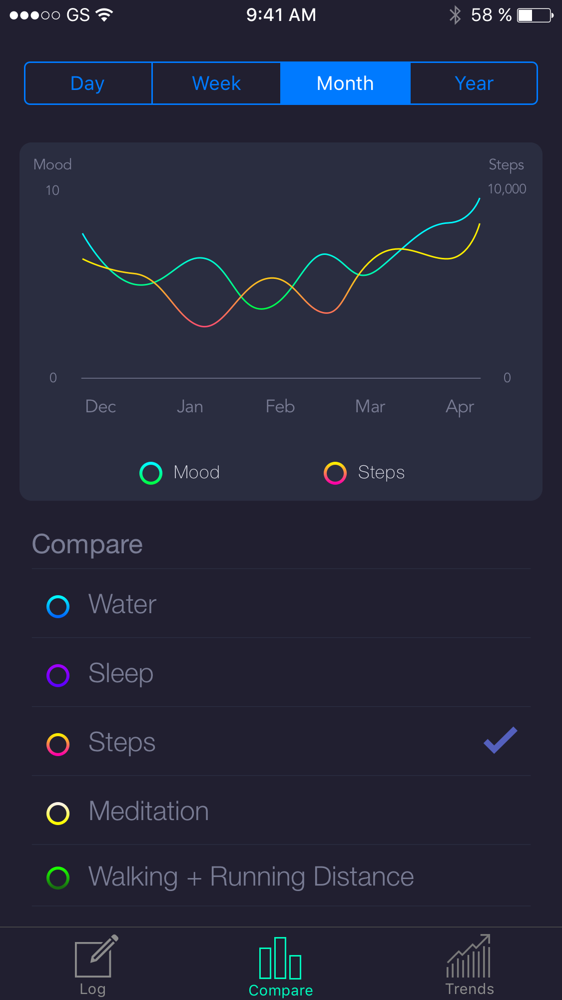
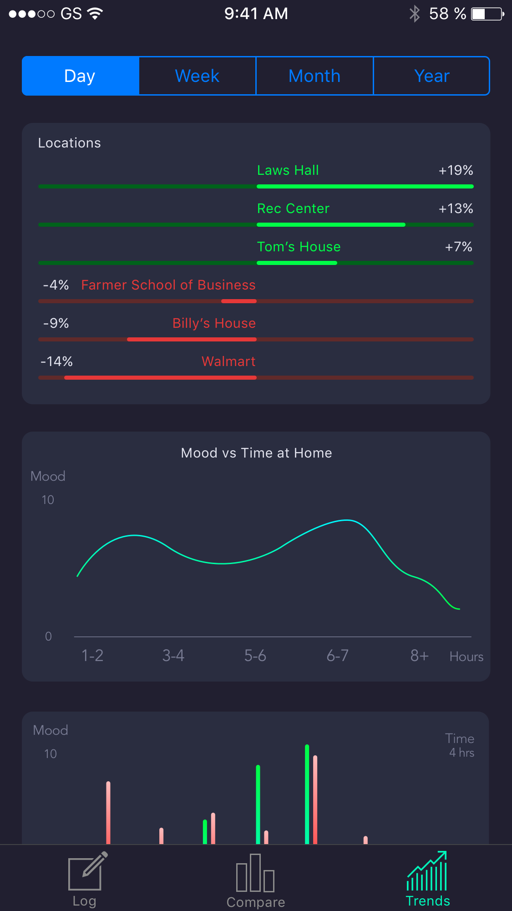
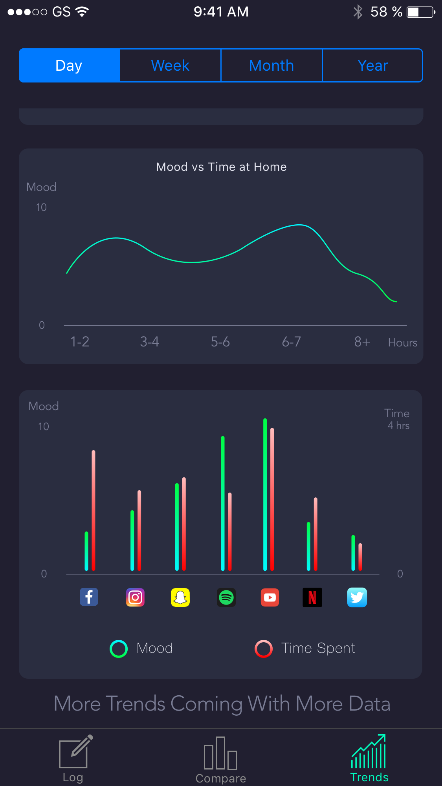

# Trackr

Trackr is a mobile application written in react-native that tracks a users mood over time and compares it with other health stats to promote better mental health. Takes advantage of HealthKit.

## Features

`trackr` is still a work in progress, but currently has implemented:
 - Account creation
 - Full authentication and log in capabilities
 - Log different moods to a remote server
 - Display mood over time on a chart - WIP

## Mockups

Below are the initial mockups to guide development. Features will most likely be adjusted and change throughout versioning.

### Log

### Compare

### Trends

## License

This project is licensed under the MIT License
